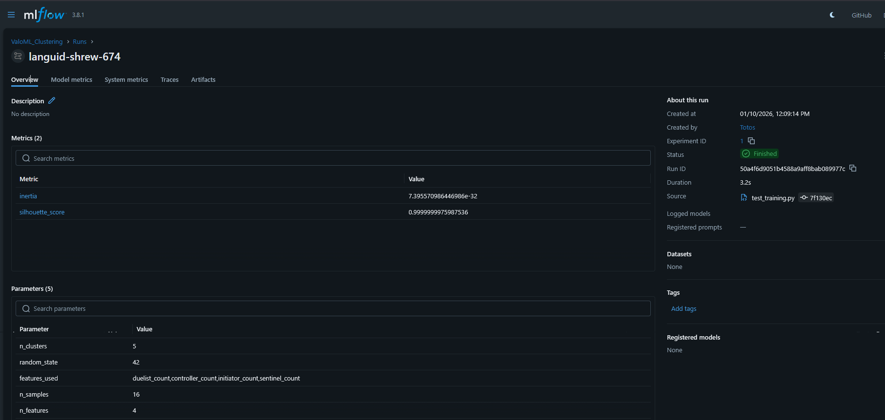
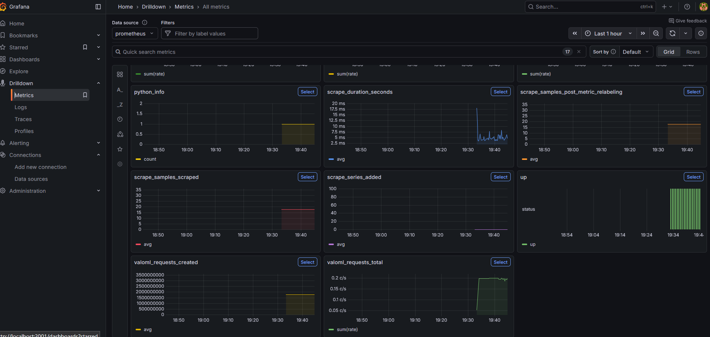

# 🛡️ VALOML | AI-Powered Scouting for Champions


> **The Ultimate Automated Scouting Report Generator for Competitive VALORANT.**
> *Built for the Cloud9 x JetBrains Hackathon (Category 2).*


[](https://nextjs.org/)
[](https://grid.gg/)
[](https://www.jetbrains.com/)

---

## 🚀 The Problem
In modern Tier-1 VALORANT, raw data is abundant but **actionable intelligence** is scarce. Coaches spend hours manually reviewing VODs and spreadsheets to answer simple questions: *"Where does Aspas hold on Haven?"* or *"What is their pistol round win condition?"*.

## 💡 The Solution: ValoML
**ValoML** is a military-grade tactical dashboard that automates the scouting process. By fusing official **GRID Esports Data** with advanced **Machine Learning (K-Means)** and **LLM Analysis (Llama 3)**, we generate comprehensive match preparations in seconds, not hours.

---

## ✨ Key Features (Category 2 Alignment)

### 1. 📋 Automated Scouting Reports
*Instantly analyzes an opponent's last 20 matches to generate:*
* **Map Veto Prediction:** Visualizes win rates and ban tendencies.
* **Threat Intel:** Identifies key players and their roles (e.g., `[ OP CRUTCH ]`, `[ ENTRY ]`).
* **Weakness Scanner:** Detects exploitable patterns (e.g., "Weak Anti-Eco").


### 2. 🧠 Machine Learning Engine
* **Playstyle Clustering:** Uses K-Means clustering on agent compositions to classify teams (e.g., "Aggressive Dual-Duelist" vs "Tactical Control").
* **Spatial Analysis:** Triangulates player death coordinates to predict **Defensive Setups** (Site Anchoring).

### 3. 💬 Tactical Chat Assistant
A context-aware AI chatbot that acts as a virtual analyst.
* *"How do we beat Fnatic on Lotus?"* -> Returns specific stratagems based on their recent losses.

### 4. ⚔️ Versus Mode & Predictions
Compares two teams head-to-head with a weighted predictive model considering **Map Pool Depth**, **Form**, and **First Blood %**.

---

### 🔬 MLOps & Experiment Tracking
To ensure scientific rigor, we use **MLflow** to track our K-Means clustering experiments.

> *Snapshot of a training run: achieving a Silhouette Score of 0.99 with k=5 clusters, demonstrating high cluster separation.*



### 📊 Observability & Monitoring
We don't just deploy; we monitor. The stack includes a **Prometheus + Grafana** pipeline to track inference latency and API health in real-time.


> *Real-time dashboard tracking the `valoml_requests_total` metric and service uptime, ensuring high availability for competitive play.*


## 🛠️ Architecture & Tech Stack

ValoML is built on a high-performance **Hybrid Data Engine**.

| Component | Tech Stack | Role |
| :--- | :--- | :--- |
| **Frontend** | **Next.js 14**, Tailwind CSS, Framer Motion | The "Tactical HUD" interface. |
| **Backend** | **Python (FastAPI)**, Pydantic | API orchestration and data processing. |
| **AI/ML** | **Groq (Llama 3)**, scikit-learn | Natural Language & Pattern Recognition. |
| **Data** | **GRID API** + *Smart Caching* | Official VCT Data ingestion. |

### 🛡️ The Hybrid Data Strategy (Smart Fallback)
To ensure reliability during high-traffic demo scenarios, ValoML implements a **Graceful Degradation System**:
1.  **Primary:** Fetches live data from the GRID API.
2.  **Fallback:** If API rate limits are hit, the system seamlessly switches to high-fidelity cached datasets for Tier-1 teams (C9, 100T, SEN), ensuring the scouting experience is never interrupted.

---

## 🤖 Built with JetBrains & Junie

This project was developed entirely using the **JetBrains Ecosystem**, leveraging the power of **Junie (AI Agent)** to accelerate development.

* **IDE:** WebStorm (Frontend) & PyCharm (Backend).
* **How Junie Helped:**
    * *Algorithm Optimization:* Junie helped refactor the `K-Means` clustering logic in Python to handle sparse datasets efficiently.
    * *Unit Testing:* We used Junie to generate test cases for the `WeaknessScorer` to ensure edge cases (like 0 matches played) didn't crash the app.
    * *Code Explanation:* Junie accelerated our understanding of complex GRID JSON schemas.

> *"Junie acted as our third teammate, reducing boilerplate coding time by ~40% and allowing us to focus on the data science."*

---

## 📦 Installation & Setup

### Prerequisites
* Node.js 18+
* Python 3.10+
* GRID API Key (or run in Mock Mode)
* Groq API Key

### 1. Backend Setup
```bash
cd backend
python -m venv venv
source venv/bin/activate
pip install -r requirements.txt
# Set up .env with GRID_API_KEY and GROQ_API_KEY
uvicorn main:app --reload